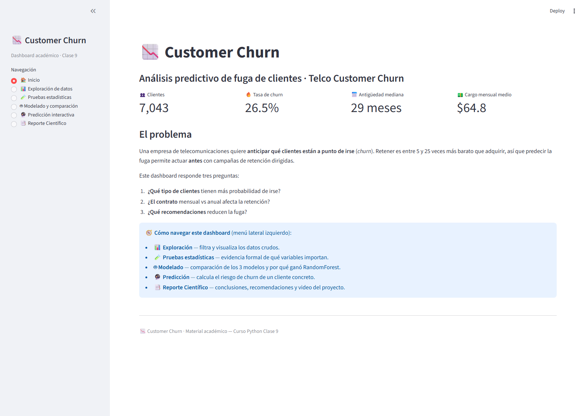
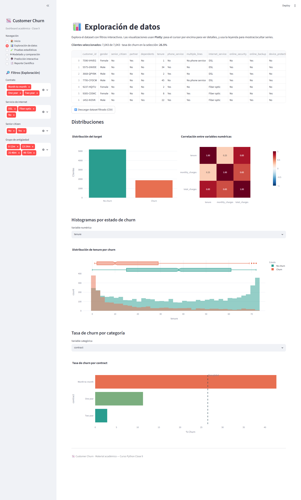
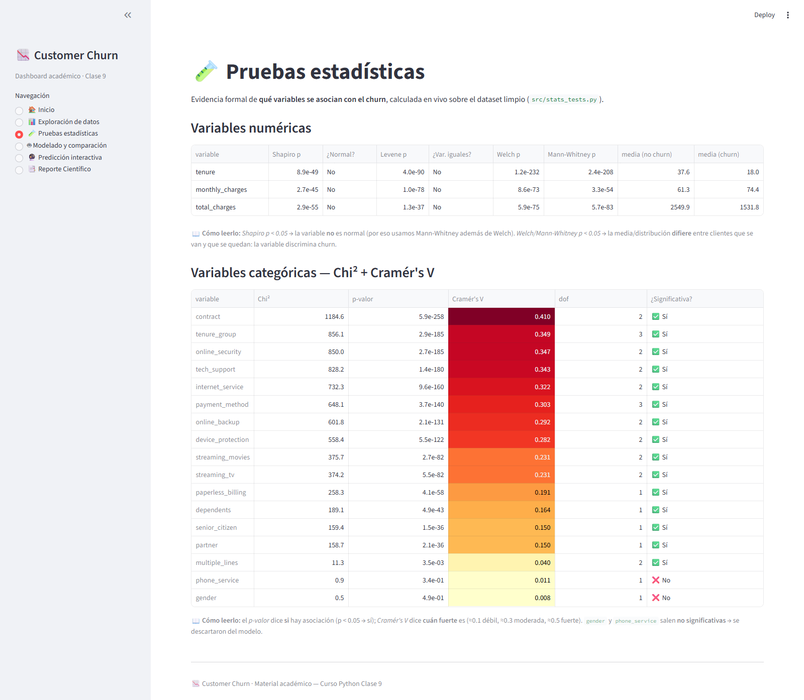
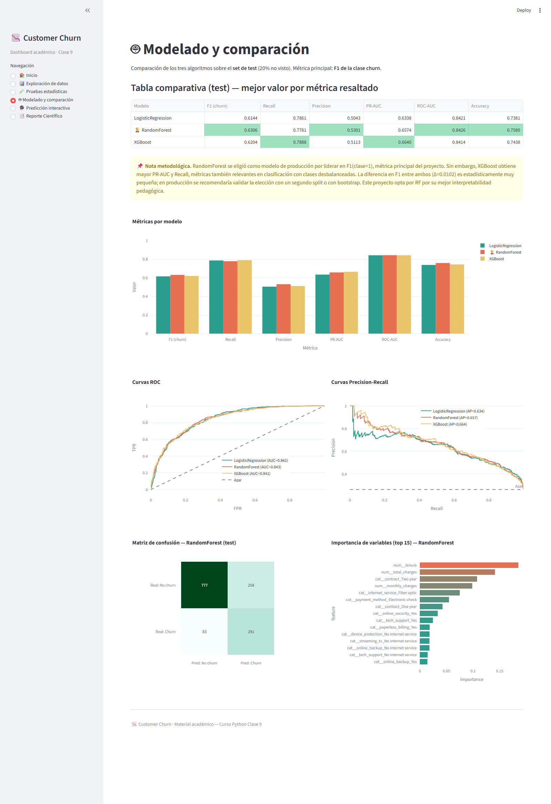
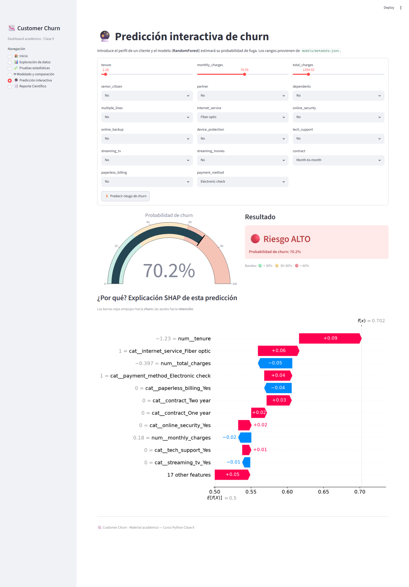
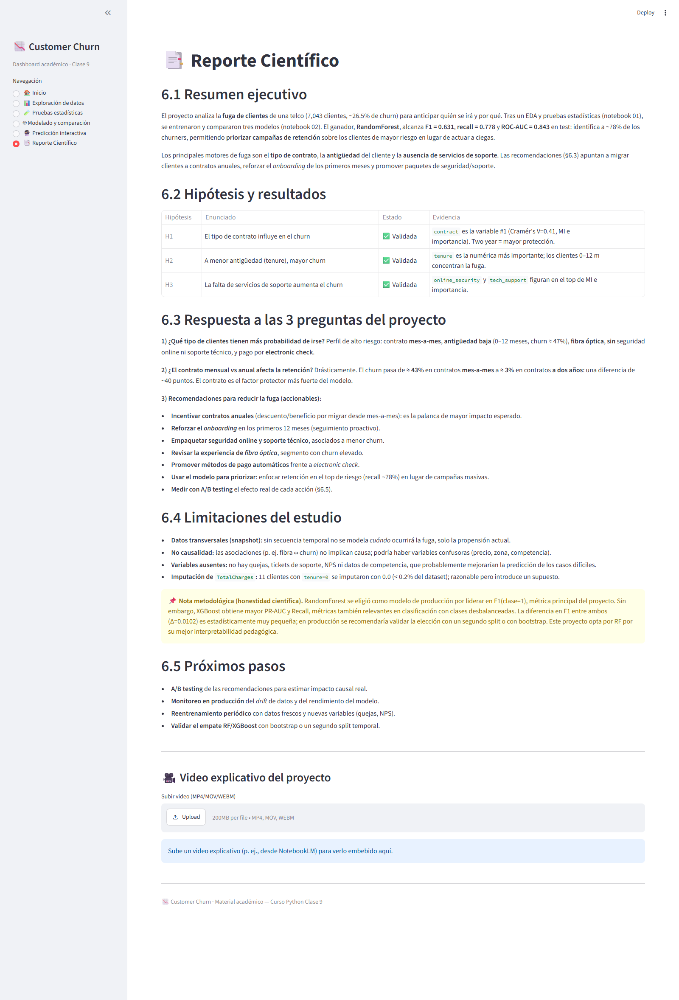

# 📉 Telco Customer Churn — Análisis Predictivo de Fuga de Clientes

> Predice qué clientes de una telco están a punto de irse, explica **por qué** y lo expone en un dashboard interactivo. De los datos crudos al modelo en producción.


---

## 🚀 Demo en vivo

**🔗 [Abrir dashboard en Railway](https://telco-customer-churn-PRODUCTION.up.railway.app)**

> ⏳ *URL provisional — se actualizará con el enlace real una vez completado el despliegue en Railway.*

---

## 📊 Capturas

| | |
|---|---|
|  | **Inicio.** KPIs del negocio: 7,043 clientes, 26.5 % de churn, antigüedad mediana y cargo mensual. |
|  | **Exploración.** Filtros interactivos, heatmap de correlación, histogramas y tasa de churn por categoría (Plotly). |
|  | **Pruebas estadísticas.** Shapiro, Levene, Welch, Mann-Whitney y Chi² + Cramér's V calculados en vivo. |
|  | **Modelado.** Comparación de los 3 modelos: tabla de métricas, curvas ROC/PR, matriz de confusión e importancias. |
|  | **Predicción interactiva.** Perfil de un cliente → *gauge* de riesgo + explicación **SHAP** individual (waterfall). |
|  | **Reporte científico.** Conclusiones, validación de hipótesis y recomendaciones accionables. |

---

## 🎯 ¿Qué hace este proyecto?

Una empresa de telecomunicaciones pierde clientes a un ritmo del **~26.5 %**. Como retener es entre 5 y 25 veces más barato que adquirir, anticipar **quién** se irá permite enfocar campañas de retención en lugar de actuar a ciegas. Este proyecto recorre el flujo completo de ciencia de datos: limpieza y *feature engineering*, análisis exploratorio, pruebas estadísticas formales, modelado y un dashboard de producción.

Se entrenaron y compararon **tres modelos** de clasificación (Regresión Logística, Random Forest y XGBoost) sobre un *split* estratificado 80/20, optimizando el **F1 de la clase churn** (la clase minoritaria, donde la *accuracy* engaña). El modelo seleccionado, **Random Forest**, alcanza **F1 = 0.63** y **recall = 0.78**: identifica a ~78 % de los clientes que efectivamente se van, habilitando la priorización del segmento de mayor riesgo.

El proyecto responde tres preguntas de negocio: **(1)** qué tipo de clientes tienen más probabilidad de irse (contrato mensual, antigüedad baja, fibra óptica, sin soporte, *electronic check*); **(2)** cuánto afecta el contrato a la retención (el churn cae de **42.7 %** en mes-a-mes a **2.8 %** en contratos a dos años); y **(3)** qué acciones reducen la fuga. Cada predicción se acompaña de una explicación **SHAP** individual para hacerla transparente.

---

## 🛠 Stack

- **Lenguaje:** Python 3.12
- **Datos:** pandas · NumPy · SciPy
- **Modelado:** scikit-learn · XGBoost
- **Interpretabilidad:** SHAP
- **Visualización:** Plotly · Matplotlib · Seaborn
- **Dashboard:** Streamlit
- **Despliegue:** Railway
- **Serialización:** joblib

---

## 📂 Estructura del proyecto

```
telco-customer-churn/
├── data/
│   ├── raw/                      # dataset original
│   └── processed/churn_clean.csv # dataset limpio (generado)
├── notebooks/
│   ├── 01_etl_eda.ipynb          # ETL + EDA + pruebas estadísticas
│   └── 02_modeling.ipynb         # modelado + comparación + artefactos
├── src/                          # módulos reutilizables (carga, limpieza, EDA, stats, modeling)
├── models/
│   ├── best_model.pkl            # pipeline ganador (RandomForest)
│   ├── metadata.json             # features, rangos, hiperparámetros, métricas
│   └── model_comparison.json     # métricas 3 modelos, curvas, nota metodológica
├── app/
│   └── dashboard.py              # dashboard Streamlit (6 páginas)
├── reports/
│   ├── report.md / report.pdf    # reporte académico completo
│   └── figures/                  # gráficos + figures/dashboard/ (capturas)
├── .streamlit/config.toml        # tema y configuración del servidor
├── Procfile / runtime.txt        # despliegue en Railway
├── requirements.txt              # dependencias de runtime
├── dev-requirements.txt          # dependencias de desarrollo
└── LICENSE                       # MIT
```

---

## ⚡ Cómo correr localmente

```bash
git clone https://github.com/arturomagdiel666/telco-customer-churn.git
cd telco-customer-churn
pip install -r requirements.txt
streamlit run app/dashboard.py
```

El dashboard se abre en `http://localhost:8501`. El repositorio incluye el modelo
entrenado (`models/best_model.pkl`), así que **no es necesario re-entrenar** para
probar la app. Para reproducir el entrenamiento desde cero, ejecuta los notebooks
`01` y `02` (requiere `pip install -r dev-requirements.txt`).

---

## 📑 Reporte académico

El análisis completo (metodología, resultados, validación de hipótesis, limitaciones
y recomendaciones) está documentado en:

- 📄 **[reports/report.pdf](reports/report.pdf)** — reporte en PDF con figuras.
- 📝 **[reports/report.md](reports/report.md)** — fuente en Markdown.

---

## 🔬 Hallazgos clave

Comparación de los tres modelos sobre el conjunto de **test (20 % no visto, split estratificado)**:

| Modelo | F1 (churn) | Recall | Precision | PR-AUC | ROC-AUC | Accuracy |
|---|---|---|---|---|---|---|
| LogisticRegression | 0.6144 | 0.7861 | 0.5043 | 0.6338 | 0.8421 | 0.7381 |
| **🏆 RandomForest** | **0.6306** | 0.7781 | **0.5301** | 0.6574 | **0.8426** | **0.7580** |
| XGBoost | 0.6204 | **0.7888** | 0.5113 | **0.6640** | 0.8414 | 0.7438 |

**Modelo ganador: RandomForest** (`n_estimators=400`, `max_depth=10`, `min_samples_split=10`, `class_weight='balanced'`), elegido por liderar en la métrica principal (F1 de churn) y por su interpretabilidad.

> **Nota metodológica (empate técnico).** La diferencia de F1 entre RandomForest y XGBoost es muy pequeña (**Δ = 0.0102**), y XGBoost de hecho lidera en PR-AUC y Recall. La elección de RF responde a interpretabilidad pedagógica, no a una superioridad estadística contundente; en producción se recomendaría validar con *bootstrap* o un segundo *split*.

**Principales motores de fuga:** tipo de contrato, antigüedad (*tenure*) y ausencia de servicios de soporte/seguridad. Las tres hipótesis del proyecto (contrato, antigüedad, soporte) quedaron validadas con evidencia estadística.

---

## 📜 Licencia

Distribuido bajo la licencia **MIT**. Ver [LICENSE](LICENSE) para más detalles.

---

## 👤 Autor

**Arturo Magdiel**
🔗 GitHub: [@arturomagdiel666](https://github.com/arturomagdiel666)

> Proyecto académico — Curso Python. Datos: *Telco Customer Churn* (IBM / Kaggle).
