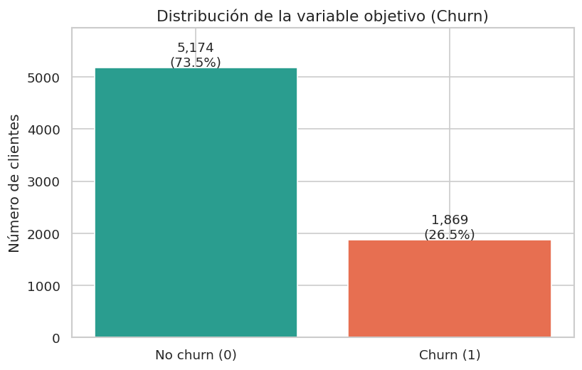
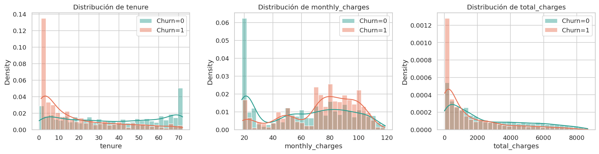
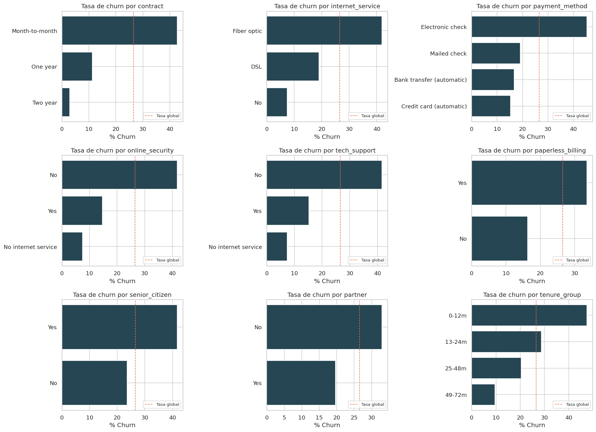
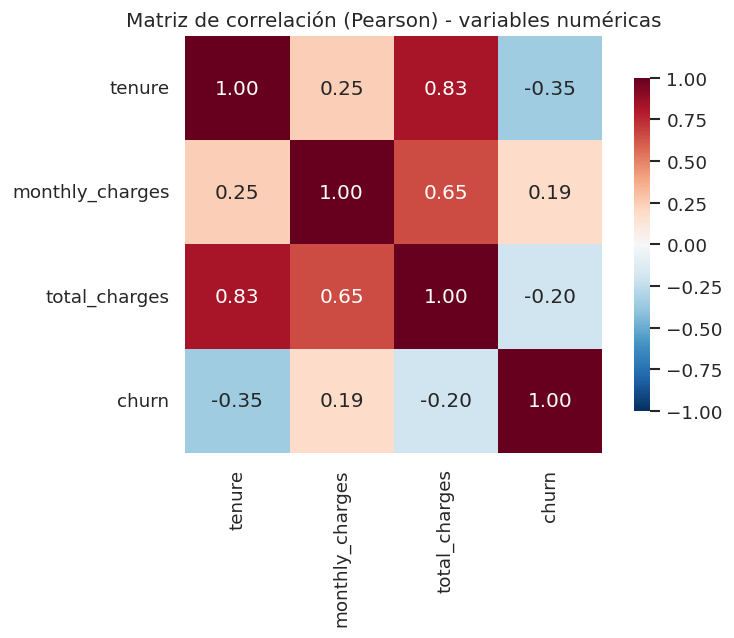
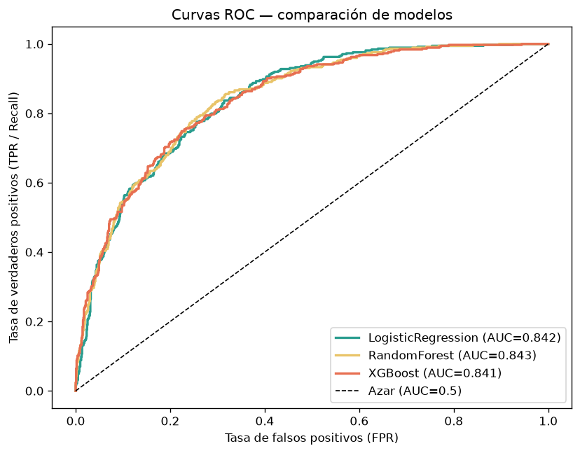
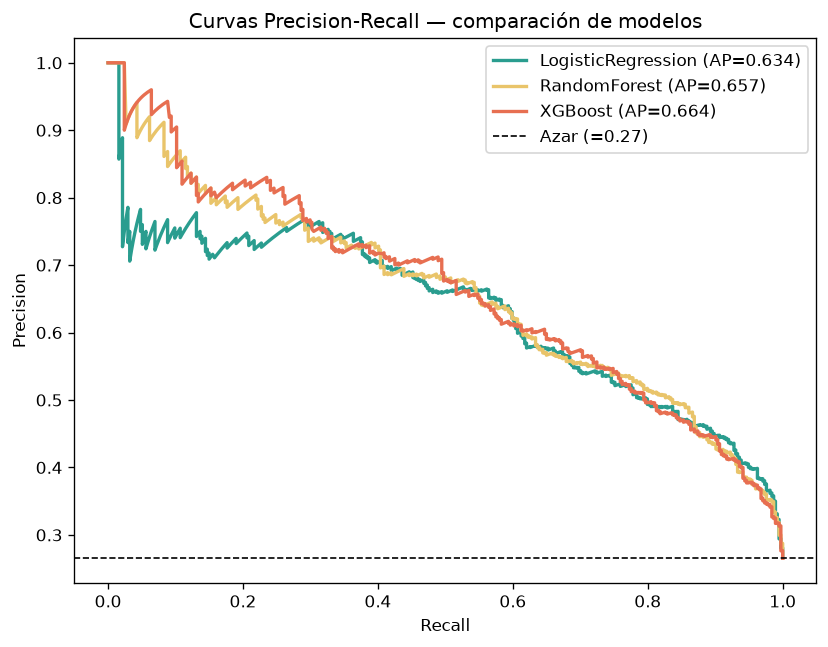
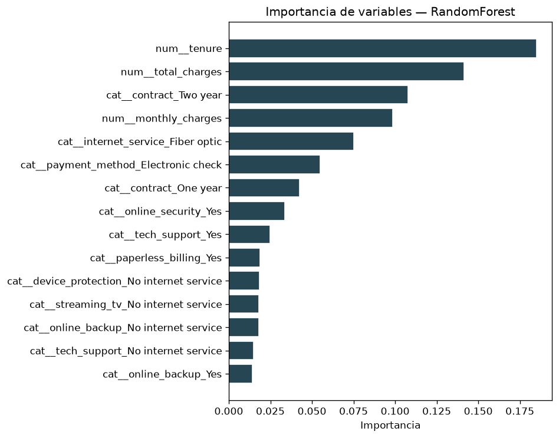
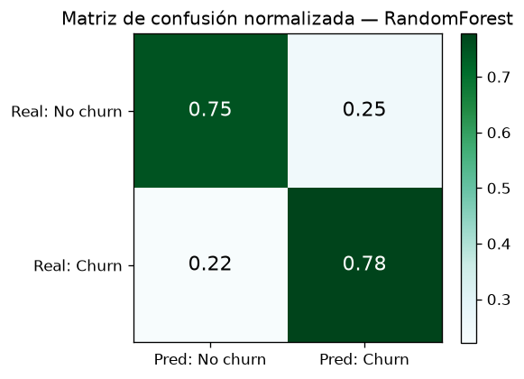
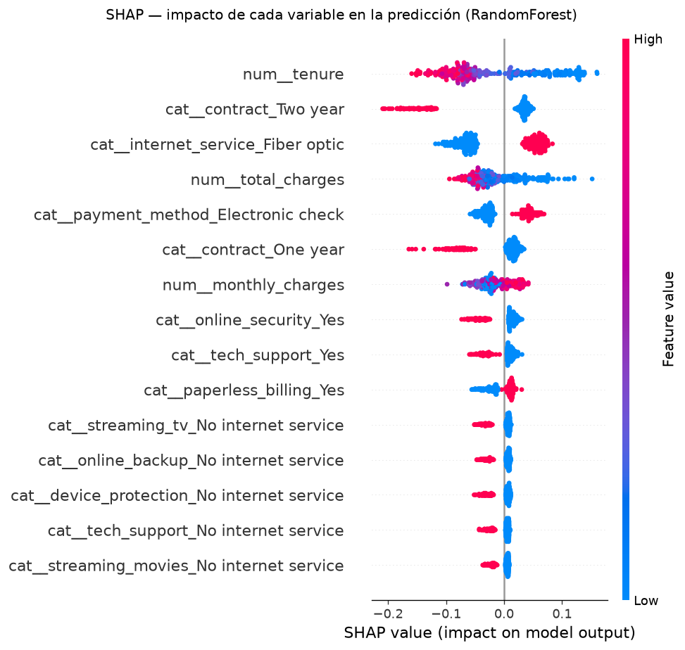

# Predicción de Fuga de Clientes (Customer Churn) — Reporte Académico

**Proyecto:** Telco Customer Churn · Curso Python — Clase 9
**Modelo de producción:** RandomForest (`class_weight='balanced'`, `max_depth=10`, `n_estimators=400`, `min_samples_split=10`)
**Semilla global:** `RANDOM_STATE = 42`
**Fecha:** 2026-06-27

---

## Índice

1. [Resumen ejecutivo](#1-resumen-ejecutivo)
2. [Introducción y contexto](#2-introducción-y-contexto)
3. [Dataset y exploración](#3-dataset-y-exploración)
4. [Metodología](#4-metodología)
5. [Modelado y resultados](#5-modelado-y-resultados)
6. [Análisis de resultados](#6-análisis-de-resultados)
7. [Conclusiones e insights](#7-conclusiones-e-insights)
8. [Apéndice](#8-apéndice)

---

## 1. Resumen ejecutivo

Una empresa de telecomunicaciones pierde clientes (*churn*) a un ritmo del **26.5 %** (1,869 de 7,043 clientes). Como retener es entre 5 y 25 veces más barato que adquirir, anticipar **quién** se irá y **por qué** permite enfocar campañas de retención en lugar de actuar a ciegas.

Tras un análisis exploratorio (EDA) y pruebas estadísticas formales (notebook `01_etl_eda.ipynb`), se entrenaron y compararon tres modelos de clasificación (notebook `02_modeling.ipynb`): **Regresión Logística**, **Random Forest** y **XGBoost**, optimizando como métrica principal el **F1 de la clase churn** (clase positiva, minoritaria y desbalanceada).

El modelo seleccionado para producción es **Random Forest**, con los siguientes resultados sobre el conjunto de prueba (20 % no visto, *split* estratificado):

| Métrica | Valor |
|---|---|
| F1 (churn) | **0.631** |
| Recall (churn) | **0.778** |
| Precision (churn) | 0.530 |
| PR-AUC | 0.657 |
| ROC-AUC | 0.843 |
| Accuracy | 0.758 |

El modelo **identifica ~78 % de los clientes que efectivamente se van** (recall), lo que habilita priorización de retención sobre el segmento de mayor riesgo. Los principales motores de fuga son el **tipo de contrato**, la **antigüedad** (*tenure*) y la **ausencia de servicios de soporte/seguridad**.

> **📌 Nota metodológica (honestidad científica).** RandomForest lidera en F1, pero XGBoost obtiene mayor PR-AUC y Recall; la diferencia en F1 es muy pequeña (**Δ = 0.0102**). La elección de RF se justifica por interpretabilidad pedagógica, no por superioridad estadística contundente. Ver §5 para el texto literal.

Las tres hipótesis del proyecto (H1: contrato, H2: antigüedad, H3: soporte) quedaron **validadas** con evidencia estadística y de importancia de variables.

---

## 2. Introducción y contexto

### 2.1 El problema

Una compañía de telecomunicaciones (telco) quiere **anticipar qué clientes están a punto de darse de baja** para intervenir con campañas de retención dirigidas. El churn es un problema de negocio crítico: el costo de adquirir un cliente nuevo supera ampliamente el de retener uno existente, por lo que cada punto de churn evitado tiene impacto directo en los ingresos recurrentes.

### 2.2 Preguntas del proyecto

1. **¿Qué tipo de clientes** tienen más probabilidad de irse?
2. **¿El tipo de contrato** (mensual vs anual) afecta la retención?
3. **¿Qué recomendaciones accionables** reducen la fuga?

### 2.3 Hipótesis

| ID | Hipótesis | Métrica/Prueba de validación |
|----|-----------|------------------------------|
| **H1** | El tipo de contrato influye en el churn | Chi² + Cramér's V; importancia en el modelo |
| **H2** | A menor antigüedad (*tenure*), mayor churn | Mann-Whitney / Welch; importancia numérica |
| **H3** | La falta de servicios de soporte aumenta el churn | Chi² + Cramér's V sobre `online_security`, `tech_support` |

### 2.4 Métrica principal

Dado que la clase de interés (churn = 1) es **minoritaria (~26.5 %)**, la *accuracy* es engañosa. Se optimiza el **F1 de la clase churn**, que equilibra *precision* y *recall*, y se reporta además **PR-AUC** (más informativa que ROC-AUC en problemas desbalanceados) y **recall** (coste de no detectar a un cliente que se va).

---

## 3. Dataset y exploración

### 3.1 Descripción

El dataset Telco Customer Churn contiene **7,043 clientes** y **21 variables originales** (más `tenure_group`, derivada en *feature engineering*). El objetivo es la variable binaria `churn`.

### 3.2 Tabla de calidad de datos

| Aspecto | Resultado | Acción |
|---|---|---|
| Registros | 7,043 | — |
| Variables | 21 originales + 1 derivada (`tenure_group`) | — |
| Duplicados | 0 | — |
| Nulos (tras limpieza) | 0 | — |
| `TotalCharges` no numérico | 11 registros (espacios en blanco) | Coerción a numérico + imputación |
| Clientes con `tenure = 0` | 11 (**0.156 %** del dataset) | `TotalCharges` imputado a 0.0 |
| Variable objetivo `churn` | 26.5 % positivos (1,869) | Clase desbalanceada → `class_weight='balanced'` |

### 3.3 Justificación de la imputación de `TotalCharges = 0.0`

Los **11 clientes con `tenure = 0`** corresponden a altas recientes que aún no han generado un ciclo de facturación; su `TotalCharges` viene como cadena vacía en el CSV original. Se imputó **`TotalCharges = 0.0`** porque es la interpretación semánticamente correcta: un cliente con cero meses de antigüedad **no ha acumulado cargos totales**.

**Alternativa descartada — eliminar las filas:** se evaluó eliminar esos 11 registros, pero se descartó porque **sesgaría la muestra de clientes nuevos** (`tenure` bajo), justamente el segmento de **mayor churn** (47.4 % en 0–12 meses) y el más relevante para el negocio. Eliminarlos empobrecería el aprendizaje del modelo sobre el perfil de alto riesgo. Al representar **< 0.2 % del dataset**, la imputación a 0.0 es de impacto despreciable y no introduce ruido.

### 3.4 Exploración (EDA)

**Distribución del objetivo** — el dataset está desbalanceado (~73.5 % no churn / 26.5 % churn):


*Figura 1. Distribución de la variable objetivo: ~73.5 % de clientes retenidos frente a ~26.5 % que abandonan.*

**Distribuciones numéricas** — `tenure`, `monthly_charges` y `total_charges` segmentadas por churn:


*Figura 2. Los clientes que se van concentran tenure bajo y cargos mensuales altos.*

**Tasa de churn por categoría** — evidencia visual de qué categorías disparan la fuga:


*Figura 3. Tasa de churn por categoría: contrato mensual, fibra óptica y pago electronic check destacan.*

**Correlación entre numéricas** — `tenure` y `total_charges` están fuertemente correlacionadas (≈0.83):


*Figura 4. Heatmap de correlación. La alta correlación tenure↔total_charges (VIF≈9.5) se conserva: los árboles son inmunes a multicolinealidad y la regresión está regularizada.*

**Tasas de churn observadas (datos limpios):**

| Variable | Categoría | Tasa de churn |
|---|---|---|
| `contract` | Month-to-month | **42.7 %** |
| `contract` | One year | 11.3 % |
| `contract` | Two year | **2.8 %** |
| `tenure_group` | 0–12 m | **47.4 %** |
| `tenure_group` | 49–72 m | 9.5 % |
| `internet_service` | Fiber optic | **41.9 %** |
| `internet_service` | DSL | 19.0 % |
| `tech_support` | No | **41.6 %** |
| `tech_support` | Yes | 15.2 % |
| `payment_method` | Electronic check | **45.3 %** |

---

## 4. Metodología

### 4.1 Limpieza de datos (`src/data_cleaning.py`)

- Normalización de nombres de columnas a **snake_case**.
- Coerción de `TotalCharges` a numérico e imputación de los 11 `tenure = 0` a 0.0 (§3.3).
- Verificación de duplicados (0) y consistencia de categorías.
- *Feature engineering*: `tenure_group` (0–12 m, 13–24 m, 25–48 m, 49–72 m).

### 4.2 Selección de variables

Se descartaron **`gender`** y **`phone_service`** por resultar **no significativas** en las pruebas Chi² (p > 0.05, Cramér's V ≈ 0.01), evitando ruido sin pérdida de señal.

### 4.3 *Split* estratificado 80/20

- División **train/test = 80/20**, **estratificada** por `churn` para preservar la proporción de clases (26.5 %) en ambos conjuntos.
- `random_state = 42` en todo el pipeline (reproducibilidad).
- Conjunto de prueba: **1,409 clientes** (374 churn / 1,035 no churn).

### 4.4 Pipeline de preprocesamiento

Se usa un `Pipeline` de scikit-learn con `ColumnTransformer`:

- **Numéricas** (`tenure`, `monthly_charges`, `total_charges`): estandarización (`StandardScaler`).
- **Categóricas** (14 variables): `OneHotEncoder(handle_unknown='ignore')`.
- El preprocesamiento se **ajusta solo con train** (evita *data leakage*) y se serializa junto al modelo en `models/best_model.pkl`.

### 4.5 Reproducibilidad

Semilla 42 fijada en *split*, validación cruzada y modelos. Artefactos versionados: `best_model.pkl`, `metadata.json`, `model_comparison.json`.

---

## 5. Modelado y resultados

### 5.1 Modelos comparados

Tres algoritmos entrenados sobre el mismo *split* y pipeline:

1. **LogisticRegression** (`class_weight='balanced'`) — *baseline* lineal interpretable.
2. **RandomForest** (`class_weight='balanced'`) — *ensemble* de árboles, robusto a multicolinealidad.
3. **XGBoost** — *gradient boosting*, alto poder predictivo.

### 5.2 Tabla comparativa completa (6 métricas, conjunto de test)

| Modelo | F1 (churn) | Recall | Precision | PR-AUC | ROC-AUC | Accuracy |
|---|---|---|---|---|---|---|
| LogisticRegression | 0.6144 | 0.7861 | 0.5043 | 0.6338 | 0.8421 | 0.7381 |
| **🏆 RandomForest** | **0.6306** | 0.7781 | **0.5301** | 0.6574 | **0.8426** | **0.7580** |
| XGBoost | 0.6204 | **0.7888** | 0.5113 | **0.6640** | 0.8414 | 0.7438 |

*(Negritas = mejor valor por columna.)*

### 5.3 Validación cruzada y *tuning* de hiperparámetros

- **Búsqueda de hiperparámetros** (`GridSearchCV`/`RandomizedSearchCV`) con **validación cruzada estratificada** sobre train, optimizando F1 de churn.
- **Mejor F1 en CV (RandomForest): 0.637** — consistente con el F1 de test (0.631), lo que indica **ausencia de sobreajuste**.
- Hiperparámetros ganadores:

```json
{
  "n_estimators": 400,
  "max_depth": 10,
  "min_samples_split": 10,
  "class_weight": "balanced"
}
```

### 5.4 Curvas ROC y Precision-Recall


*Figura 5. Curvas ROC. Los tres modelos son prácticamente equivalentes en ROC-AUC (≈0.842).*


*Figura 6. Curvas Precision-Recall. XGBoost lidera en PR-AUC (0.664), seguido de RandomForest (0.657); ambas muy por encima del azar (0.265).*

### 5.5 Nota metodológica (texto literal)

El siguiente texto se reproduce **verbatim** desde `models/model_comparison.json['methodological_note']` y se muestra idéntico en el dashboard (página *Modelado*) y en este reporte:

> RandomForest se eligió como modelo de producción por liderar en F1(clase=1), métrica principal del proyecto. Sin embargo, XGBoost obtiene mayor PR-AUC y Recall, métricas también relevantes en clasificación con clases desbalanceadas. La diferencia en F1 entre ambos (Δ=0.0102) es estadísticamente muy pequeña; en producción se recomendaría validar la elección con un segundo split o con bootstrap. Este proyecto opta por RF por su mejor interpretabilidad pedagógica.

---

## 6. Análisis de resultados

### 6.1 Importancia de variables


*Figura 7. Importancia de variables (RandomForest). Lideran tenure, total_charges, contract_Two year, monthly_charges y internet_service_Fiber optic.*

| # | Variable | Importancia |
|---|---|---|
| 1 | `tenure` | 0.185 |
| 2 | `total_charges` | 0.141 |
| 3 | `contract_Two year` | 0.108 |
| 4 | `monthly_charges` | 0.099 |
| 5 | `internet_service_Fiber optic` | 0.075 |
| 6 | `payment_method_Electronic check` | 0.055 |
| 7 | `contract_One year` | 0.043 |
| 8 | `online_security_Yes` | 0.034 |
| 9 | `tech_support_Yes` | 0.025 |

### 6.2 Matriz de confusión (RandomForest, test)


*Figura 8. Matriz de confusión sobre 1,409 clientes de test.*

|  | Pred: No churn | Pred: Churn |
|---|---|---|
| **Real: No churn** | 777 (TN) | 258 (FP) |
| **Real: Churn** | 83 (FN) | 291 (TP) |

- **Recall = 291 / (291+83) = 0.778** → se capturan ~78 % de los churners reales.
- **Precision = 291 / (291+258) = 0.530** → ~53 % de las alertas son churn real.
- El modelo prioriza **recall** (no perder clientes que se van) sobre precision, decisión coherente con el costo asimétrico del churn.

### 6.3 Explicabilidad SHAP


*Figura 9. SHAP summary. tenure bajo, contrato mensual, fibra óptica y ausencia de soporte empujan la predicción hacia churn.*

El dashboard incluye explicaciones SHAP **por cliente** (*waterfall*). Para un cliente de alto riesgo (mes-a-mes, *tenure* ≈ 2, fibra óptica, sin soporte, *electronic check*) la probabilidad estimada es **70.2 % → 🔴 Riesgo ALTO**, con `tenure` bajo y `internet_service_Fiber optic` como principales impulsores de fuga:


*Figura 10. Página de predicción del dashboard: gauge en rojo (70.2 %) y waterfall SHAP del cliente.*

### 6.4 Validación de hipótesis

| ID | Hipótesis | Estado | Evidencia |
|----|-----------|--------|-----------|
| **H1** | El contrato influye en el churn | ✅ **Validada** | `contract` es la categórica #1 (Cramér's V = 0.41); churn M2M 42.7 % vs Two year 2.8 % |
| **H2** | Menor *tenure* → mayor churn | ✅ **Validada** | `tenure` es la numérica más importante (0.185); 0–12 m → 47.4 % churn |
| **H3** | Falta de soporte → mayor churn | ✅ **Validada** | `online_security` y `tech_support` significativas (Chi²); tech_support No → 41.6 % churn |

---

## 7. Conclusiones e insights

### 7.1 Respuesta a las 3 preguntas del proyecto

**1) ¿Qué tipo de clientes tienen más probabilidad de irse?**
Perfil de alto riesgo: contrato **mes-a-mes**, **antigüedad baja** (0–12 meses, churn ≈ **47 %**), **fibra óptica** (churn ≈ 42 %), **sin** seguridad online ni soporte técnico, y pago por **electronic check** (churn ≈ 45 %).

**2) ¿El contrato mensual vs anual afecta la retención?**
Drásticamente. El churn pasa de **42.7 %** en contratos **mes-a-mes** a **2.8 %** en contratos **a dos años** — una diferencia de **~40 puntos**. El contrato es el factor protector más fuerte del modelo.

**3) Recomendaciones accionables** (ver §7.2).

### 7.2 Recomendaciones accionables

1. **Incentivar contratos anuales/bianuales** (descuento o beneficio por migrar desde mes-a-mes): es la palanca de mayor impacto esperado.
2. **Reforzar el *onboarding*** en los primeros 12 meses con seguimiento proactivo, donde se concentra casi la mitad de la fuga.
3. **Empaquetar seguridad online y soporte técnico**, ambos asociados a menor churn.
4. **Revisar la experiencia de fibra óptica**, segmento con churn elevado (≈42 %): calidad, precio o expectativas.
5. **Promover métodos de pago automáticos** frente a *electronic check* (45 % churn).
6. **Usar el modelo para priorizar retención**: enfocar campañas en el top de riesgo (recall ~78 %) en lugar de acciones masivas.
7. **Medir con A/B testing** el efecto causal real de cada acción antes de escalar.

### 7.3 Limitaciones

- **Datos transversales (*snapshot*):** sin secuencia temporal no se modela *cuándo* ocurrirá la fuga, solo la propensión actual.
- **No causalidad:** las asociaciones (p. ej. fibra ↔ churn) no implican causa; puede haber confusores (precio, zona, competencia).
- **Variables ausentes:** sin quejas, tickets de soporte, NPS ni datos de competencia, que probablemente mejorarían los casos difíciles.
- **Imputación de `TotalCharges`:** 11 clientes con `tenure = 0` imputados a 0.0 (< 0.2 %); razonable pero es un supuesto.
- **Empate técnico RF/XGBoost:** la elección de RF no es estadísticamente contundente (Δ F1 = 0.0102); ver nota metodológica (§5.5).

### 7.4 Próximos pasos

- **A/B testing** de las recomendaciones para estimar impacto causal real.
- **Monitoreo en producción** del *drift* de datos y del rendimiento del modelo.
- **Reentrenamiento periódico** con datos frescos y nuevas variables (quejas, NPS).
- **Validar el empate RF/XGBoost** con *bootstrap* o un segundo *split* temporal.

---

## 8. Apéndice

### 8.1 Código reproducible

Estructura del proyecto:

```
customer_churn_project/
├── data/
│   ├── raw/                      # CSV original
│   └── processed/churn_clean.csv # dataset limpio
├── src/
│   ├── data_loader.py            # carga
│   ├── data_cleaning.py          # limpieza + feature engineering
│   ├── data_quality.py           # reporte de calidad
│   ├── eda.py                    # gráficos EDA
│   ├── stats_tests.py            # Shapiro, Levene, Welch, Mann-Whitney, Chi², Cramér's V
│   └── modeling.py               # pipeline, entrenamiento, comparación
├── notebooks/
│   ├── 01_etl_eda.ipynb          # ETL + EDA + pruebas estadísticas
│   └── 02_modeling.ipynb         # modelado + comparación + artefactos
├── models/
│   ├── best_model.pkl            # pipeline ganador (RandomForest)
│   ├── metadata.json             # features, rangos, hiperparámetros, métricas
│   └── model_comparison.json     # métricas 3 modelos, curvas, nota metodológica
├── app/dashboard.py              # dashboard Streamlit (6 páginas)
└── reports/
    ├── report.md / report.pdf    # este documento
    └── figures/                  # figuras de notebooks + dashboard/
```

**Reproducir** (ver checklist en `README.md` → *Verificación*):

```bash
pip install -r requirements.txt
jupyter nbconvert --to notebook --execute notebooks/01_etl_eda.ipynb
jupyter nbconvert --to notebook --execute notebooks/02_modeling.ipynb
streamlit run app/dashboard.py
```

### 8.2 Lista de figuras

**Figuras de análisis (`reports/figures/`):**

| Fig. | Archivo | Contenido |
|---|---|---|
| 1 | `01_target_distribution.png` | Distribución del objetivo churn |
| 2 | `02_numeric_distributions.png` | Distribuciones numéricas por churn |
| 3 | `03_churn_rate_by_category.png` | Tasa de churn por categoría |
| 4 | `04_correlation_heatmap.png` | Correlación entre numéricas |
| 5 | `06_roc_curves.png` | Curvas ROC (3 modelos) |
| 6 | `07_pr_curves.png` | Curvas Precision-Recall (3 modelos) |
| 7 | `05_feature_importance.png` | Importancia de variables (RF) |
| 8 | `08_confusion_matrix.png` | Matriz de confusión (RF) |
| 9 | `09_shap_summary.png` | SHAP summary |

**Capturas del dashboard (`reports/figures/dashboard/`):**

| Archivo | Página |
|---|---|
| `01_inicio.png` | Inicio / KPIs |
| `02_exploracion.png` | Exploración de datos |
| `03_pruebas_estadisticas.png` | Pruebas estadísticas |
| `04_modelado.png` | Modelado y comparación |
| `05_prediccion.png` | Predicción interactiva (Fig. 10) |
| `06_reporte_cientifico.png` | Reporte científico |

---

*Material académico — Curso Python Clase 9. Generado el 2026-06-27.*
